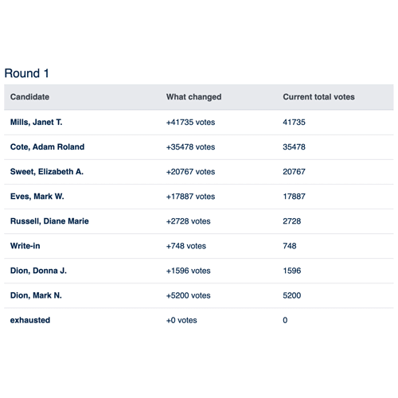
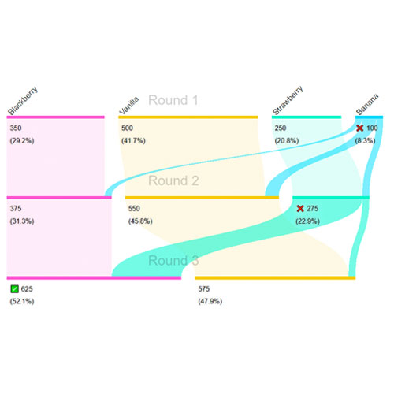
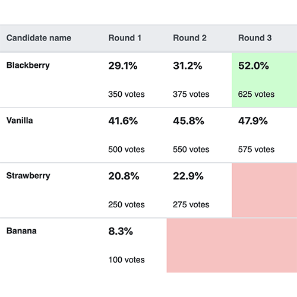

[](https://rcvis.readthedocs.io/en/latest/?badge=latest) [](https://codecov.io/gh/artoonie/rcvis)
[](https://lgtm.com/projects/g/artoonie/rcvis/context:python) [](https://lgtm.com/projects/g/artoonie/rcvis/context:javascript) [](https://lgtm.com/projects/g/artoonie/rcvis/alerts/)

# RCVis.com
This is the code repository for [rcvis.com](https://www.rcvis.com). Unless you're a programmer, you probably want to be there instead of here!

RCVis has been used to visualize hundreds of polls and dozens of elections.
It has been used as part of the official reporting of tabulation data in cities across Utah, as well as unofficially in New York City, Minnesota, Maine, California, and more.
It is connected to both [Rankit.Vote](https://rankit.vote) and [RankedVote.co](https://rankedvote.co), the premier online-RCV websites.
It can import data from Opavote, ElectionBuddy, Dominion software, RCTab, and more.
It was featured on a [Ballotpedia page](https://ballotpedia.org/June_22,_2021,_election_results) during the 2020 NYC election cycle, as well as in the [Gothamist](https://gothamist.com/arts-entertainment/big-apple-book-ballot-results-best-nyc-book), [NBC New York](https://www.nbcnewyork.com/news/politics/adams-garcia-wnbc-poll-nyc-mayor/3104963/), [Fox 5 NY](https://www.fox5ny.com/video/940333), [JD Forward](https://www.google.com/url?q=https://forward.com/culture/471811/ranked-choice-jewish-bagels-new-york-mayoral-race-seinfeld-polls/&sa=D&source=editors&ust=1636685968994000&usg=AOvVaw0CQ7-NuULv3TeJCbp8wEv8), among others.

You may fork and run this code locally, though you can probably get what you want by just uploading your data directly to RCVis.

# Ranked Choice Voting Visualization
Visualize the results of ranked-choice voting elections.

**What is RCV?** RCV allows you to have backup options. If your preferred candidate can't win, you still have a say: your vote gets _transferred_ to your next-best pick.

**Why RCV?** In an RCV election, you can't spoil votes. Third-party candidates don't waste votes. Similar candidates help each other instead of hurting each other. They're less polarized and more fair. Multi-winner RCV elections mitigate the effects of gerrymandering. For more information, check out [FairVote's guide to the benefits of RCV elections](https://www.fairvote.org/rcv#rcvbenefits).

**Why the visualizer?** In a traditional election, the results are easy to understand: how many votes did each candidate get? In an RCV election, it can be a harder to understand how a candidate won, based on what happens in each round. Our goal is to create a series of visualizations which can work for a variety of audiences on a variety of mediums: print, web, and TV.

Learn more on our Medium post: [An Illustrated Guide to Ranked-Choice Voting](https://medium.com/@armin.samii/an-illustrated-guide-to-ranked-choice-voting-4ce3c5fe73f9).

## Installation
Install python3 and virtualenv, then

```bash
virtualenv venv
source venv/bin/activate
pip3 install -e .
pip3 install -r requirements.txt
```

Create a .env file with your secrets and configuration options:

```bash
export RCVIS_SECRET_KEY=''
export RCVIS_DEBUG=True
export RCVIS_HOST=localhost

# Either have OFFLINE_MODE=True
export OFFLINE_MODE=True

# The following fields are optional, though you will
# have limited functionality without them.

# Or set up an AWS bucket and enter your credentials
# export OFFLINE_MODE=False
# export AWS_STORAGE_BUCKET_NAME=''
# export AWS_S3_REGION_NAME=''
# export AWS_ACCESS_KEY_ID=''
# export AWS_SECRET_ACCESS_KEY=''

# To send registration emails when OFFLINE_MODE is False:
# export SENDGRID_USERNAME=''
# export SENDGRID_PASSWORD=''

# To clear cloudflare cache when models update:
# export CLOUDFLARE_ZONE_ID=''
# export CLOUDFLARE_AUTH_TOKEN=''

# To run the SauceLabs integration tests, you will need
export SAUCE_USERNAME=''
export SAUCE_ACCESS_KEY=''

# To generate videos, you need:
# export SQS_QUEUE_NAME=''
# export IMAGEIO_FFMPEG_EXE='/usr/bin/ffmpeg'
# export MOVIE_FONT_NAME="Roboto"
# export AWS_POLLY_STORAGE_BUCKET_NAME="bucket-name-on-s3"

# To subscribe users to mailchimp upon registration, you need:
# export MAILCHIMP_API_KEY=''
# export MAILCHIMP_LIST_ID=''
# export MAILCHIMP_DC=''

# If you are updating a template, you'll need to clear the cache every time or set:
# export DISABLE_CACHE=True

```

To get moviepy working for Ubuntu 16.04 LTS users, comment out the following statement in `/etc/ImageMagick-6/policy.xml`:
```xml
<policy domain="path" rights="none" pattern="@*"/>
```
or, simply run `sudo ./scripts/fix-moviepy-on-ubuntu-1604.sh`

## Running
To begin serving the website at localhost:8000:
```bash
./scripts/serve.sh
```

You may also need to run this whenever the npm dependencies change:
```bash
source .env
source venv/bin/activate

npm install  # this works for me
python3 manage.py npminstall  # this is purported to work but doesn't
```

To run workers to generate movies (optional - only needed to use the movie generation flow):
```bash
source .env
source venv/bin/activate
export DISPLAY=":0" # if not already set
celery -A rcvis worker --loglevel info
```

## Examples
Check out [rcvis.com](https://www.rcvis.com) for live examples, including:

| Barchart | Round-by-Round |
| --- | --- |
|  |  |

| Sankey | Tabular Summary |
| --- | --- |
|  |  |

## REST API
The primary API documentation is in the form of [example code](visualizer/tests/testRestApiExampleCode.py), which is documented line-by-line.
We recommend you start by looking over the example code.
Addition documentation is available at [rcvis.com/api/](https://www.rcvis.com/api/).

To get started with programmatic access to rcvis:

1. Create an account on RCVis
2. Email team@rcvis.com to enable API access
3. Submit a GET request to [https://www.rcvis.com/api/auth/get-token](https://www.rcvis.com/api/auth/get-token) to obtain an API Key, e.g. `http GET https://www.rcvis.com/api/auth/get-token username='username' password="password"`.

With your API key, you may access two endpoints:
1. [https://www.rcvis.com/api/visualizations/](https://www.rcvis.com/api/visualizations/) requires field `jsonFile` with the body of a valid summary JSON.
2. [https://www.rcvis.com/api/bp/](https://www.rcvis.com/api/bp/) requires field `resultsSummaryFile` with the body of a valid summary JSON and allows four optional fields: `candidateSidecarFile`, `dataSourceURL` (string), `areResultsCertified` (boolean), and `isPrimary` (boolean).

For both endpoints, upload with POST and modify with PUT or PATCH. Authenticated users are limited to 1000 requests per hour.

## oembed
RCVis implements the [oembed protocol](http://www.oembed.com) with discoverability, allowing you to embed files into your website with an iframe.

## Testing
Cross-browser Testing Platform and Open Source ❤️ provided by [Sauce Labs](https://saucelabs.com).
