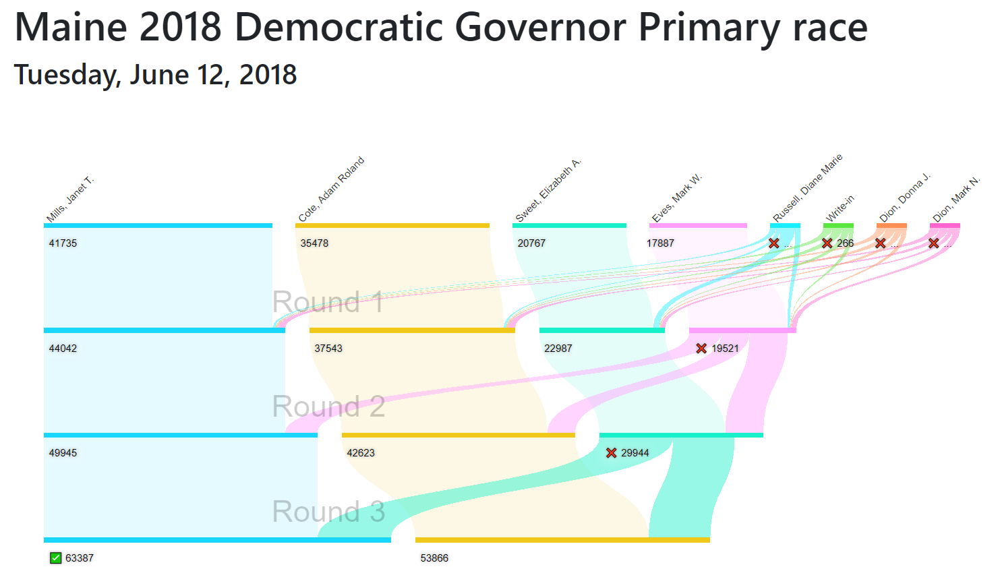
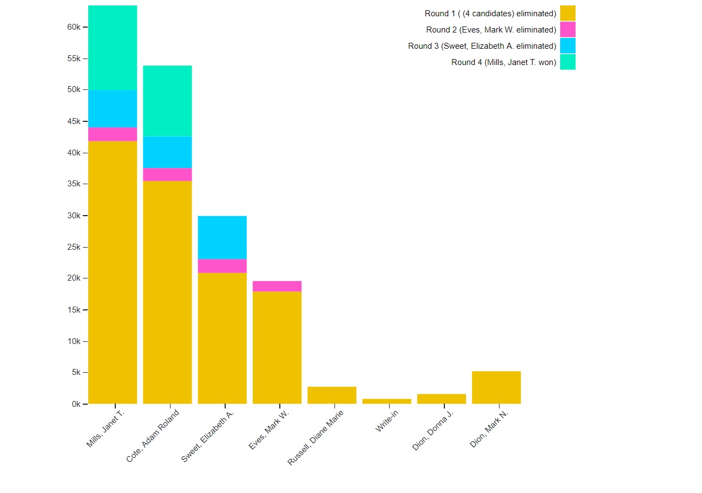
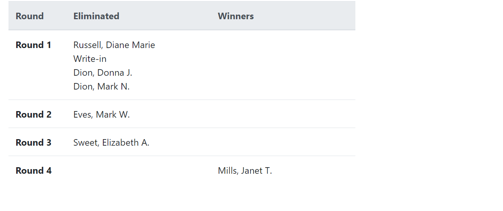
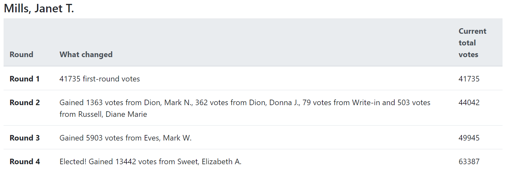

[](https://travis-ci.com/artoonie/rcvis)

# Ranked Choice Voting Visualization
Visualize ranked-choice voting results using d3.js and django.

**What is RCV?** RCV allows you to rank your top candidates. As candidates get eliminated, any votes to that candidate get transferred to the voter's next choice.

**Why RCV?** RCV is spreading. In an RCV election, you can't spoil votes. Third-party candidates don't waste votes. Similar candidates help each other instead of hurting each other. They're less polarized and more fair. Multi-winner RCV elections mitigate the effects of gerrymandering. For more information, check out [FairVote's guide to the benefits of RCV elections](https://www.fairvote.org/rcv#rcvbenefits).

**Why the visualizer?** It takes more time to understand the results of an RCV election. Instead of looking at just the number of votes, voters want to know how votes got transferred as candidates get eliminated. This can be a lot of information, so how you visualize it depends on your audience, the complexity of the election, your medium (print vs web), and more. This repo provides several visualizations, including:
- Sankey Diagrams
- Stacked bar charts
- Tabular data

Interactivity is coming soon.

## Installation & running
To run:
```bash
virtualenv venv
source venv/bin/activate
pip3 install -e .
pip3 install -r requirements.txt
python3 manage.py runserver
open localhost:8000/sankey
```

You will need several environment variables set. I recommend creating a `.env` file with the following:
```bash
export RCVIS_SECRET_KEY=''
export RCVIS_DEBUG=True
export RCVIS_HOST=localhost

# Either have OFFLINE_MODE=True
export OFFLINE_MODE=True

# Or set up an AWS bucket and enter your credentials
# export OFFLINE_MODE=False
# export AWS_STORAGE_BUCKET_NAME=''
# export AWS_S3_REGION_NAME=''
# export AWS_ACCESS_KEY_ID=''
# export AWS_SECRET_ACCESS_KEY=''
```

And running `source .env` to set up your environment.

## Functionality & manual testing of the Sankey diagram
As the functionality is changing rapidly, we do not yet have automated tests. The following is a set of regression tests to verify the Sankey diagram.:

- Top bar of candidate names
    - *Sticky*: On a short screen, when you scroll down far enough, it should become sticky and lock to the top of the page.
    - *Live Candidates*: The bar should by dynamic based on the candidates shown at the top of the screen, not the very first round.
    - As you continue to scroll down, the X positions of the candidate names should shift to continue to align with the _Live Candidates_.
    - Candidates who are not _Live Candidates_ should be removed as you scroll down.
    - On a skinny screen, when you sideways scroll (particularly when it's _Sticky_), the X position should continue to align with the _Live Candidates_.
- Drag
    - Dragging nodes should have both the text and connected links move
- Long candidate names
    - Candidate names should not overlap in the top bar. If a candidate name is very long, or a candidate’s number of votes makes its bar short, the name should automatically truncate to ellipses.
    - When you hover over these ellipses, they should reveal the candidate’s full name

## Examples
Here are four ways to visualize the results of the same election.

---

---

---



## Inpsiration
[City of Minneapolis](http://vote.minneapolismn.gov/results/2017/2017-mayor-tabulation)

[Sohan Murthy's SF Mayoral Sankey](https://medium.com/@sohanmurthy/visualizing-san-franciscos-mayoral-election-results-91db11477605)
