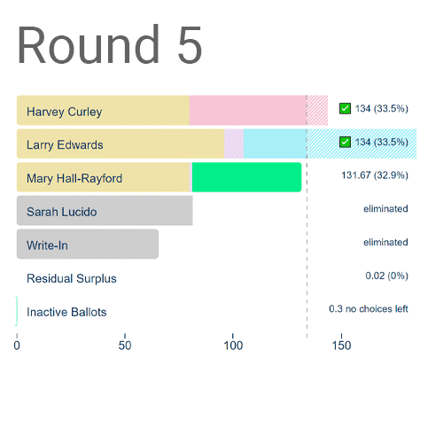

[](https://travis-ci.com/artoonie/rcvis) [](https://app.saucelabs.com/u/artoonie) [](https://rcvis.readthedocs.io/en/latest/?badge=latest) [](https://codecov.io/gh/artoonie/rcvis)

 

# RCVIS.com
This repo is live at [rcvis.com](https://www.rcvis.com).

# Ranked Choice Voting Visualization
Visualize ranked-choice voting results using d3.js and django.

**What is RCV?** RCV allows you to rank your top candidates. As candidates get eliminated, any votes to that candidate get transferred to the voter's next choice.

**Why RCV?** RCV is spreading. In an RCV election, you can't spoil votes. Third-party candidates don't waste votes. Similar candidates help each other instead of hurting each other. They're less polarized and more fair. Multi-winner RCV elections mitigate the effects of gerrymandering. For more information, check out [FairVote's guide to the benefits of RCV elections](https://www.fairvote.org/rcv#rcvbenefits).

**Why the visualizer?** In a traditional election, the results are easy to understand: how many votes did each candidate get? In an RCV election, it can be a harder to understand how a candidate one, based on what happens in each round. Our goal is to create a series of visualizations which can work for a variety of audiences on a variety of mediums: print, web, and TV.

Learn more on our Medium post: [An Illustrated Guide to Ranked-Choice Voting](https://medium.com/@armin.samii/an-illustrated-guide-to-ranked-choice-voting-4ce3c5fe73f9).

## Installation
Install python3 and virtualenv, then

```bash
virtualenv venv
source venv/bin/activate
pip3 install -e .
pip3 install -r requirements.txt
```

Create a .env file with your secrets and configuration options:

```bash
export RCVIS_SECRET_KEY=''
export RCVIS_DEBUG=True
export RCVIS_HOST=localhost

# Either have OFFLINE_MODE=True
export OFFLINE_MODE=True

# Or set up an AWS bucket and enter your credentials
# export OFFLINE_MODE=False
# export AWS_STORAGE_BUCKET_NAME=''
# export AWS_S3_REGION_NAME=''
# export AWS_ACCESS_KEY_ID=''
# export AWS_SECRET_ACCESS_KEY=''

# To run the SauceLabs integration tests, you will need
export SAUCE_USERNAME=''
export SAUCE_ACCESS_KEY=''

# To generate videos, you need:
export SQS_QUEUE_NAME=''
export IMAGEIO_FFMPEG_EXE='/usr/bin/ffmpeg'
export MOVIE_FONT_NAME="Roboto"

```

To get moviepy working for Ubuntu 16.04 LTS users, comment out the following statement in `/etc/ImageMagick-6/policy.xml`:
```xml
<policy domain="path" rights="none" pattern="@*"/>
```
or, simply run `sudo ./scripts/fix-moviepy-on-ubuntu-1604.sh`

## Running
To begin serving the website at localhost:8000:
```bash
source .env
source venv/bin/activate
python3 manage.py runserver
```

To run workers to generate movies (optional - only needed to use the movie generation flow):
```bash
source .env
source venv/bin/activate
export DISPLAY=":0" # if not already set
celery -A rcvis worker --loglevel info
```

## Examples
Check out [rcvis.com](https://www.rcvis.com) for live examples, including:

| Barchart | Round-by-Round |
| --- | --- |
|  |  |

| Sankey | Tabular Summary |
| --- | --- |
|  |  |

## Inpsiration
[City of Minneapolis](http://vote.minneapolismn.gov/results/2017/2017-mayor-tabulation)

[Sohan Murthy's SF Mayoral Sankey](https://medium.com/@sohanmurthy/visualizing-san-franciscos-mayoral-election-results-91db11477605)

[FairVote's 2018 Santa Fe Visualization](https://www.fairvote.org/2018_election)

## RESTful API
Addition documentation for the REST API is available at [rcvis.com/api/visualizations/](https://www.rcvis.com/api/visualizations/).

To get started with programmatic access to rcvis:

1. Email team@rcvis.com to obtain an account.
2. Submit a GET request to [https://www.rcvis.com/api/auth/get-token](https://www.rcvis.com/api/auth/get-token) to obtain an API Key, e.g. `http GET https://www.rcvis.com/api/auth/get-token username='username' password="password"`.
3. Submit a POST request to [https://www.rcvis.com/api/visualizations/](https://www.rcvis.com/api/visualizations/) to upload a file, including the file in the `jsonFile` field of the body.
4. For any file uploaded via the API, you may modify it using PATCH requests.

You are limited to 1000 requests per hour as an authenticated user.

## oembed
RCVIS implements the [oembed protocol](http://www.oembed.com) with discoverability, allowing you to embed files into your website with an iframe.

## Functionality specifics of the Sankey diagram
We have added a lot of complexity to the Sankey diagram to support elections with many candidates. Let this serve both as a list of specific features, and as a list of manual tests to run whenever modifying the Sankey diagram. (Yes, we have automated integration testing, but not all of these features have integration tests yet.)

- Top bar of candidate names
    - *Sticky*: On a short screen, when you scroll down far enough, it should become sticky and lock to the top of the page.
    - *Live Candidates*: The bar should by dynamic based on the candidates shown at the top of the screen, not the very first round.
    - As you continue to scroll down, the X positions of the candidate names should shift to continue to align with the _Live Candidates_.
    - Candidates who are not _Live Candidates_ should be removed as you scroll down.
    - On a skinny screen, when you sideways scroll (particularly when it's _Sticky_), the X position should continue to align with the _Live Candidates_.
- Drag
    - Dragging nodes should have both the text and connected links move
- Long candidate names
    - Candidate names should not overlap in the top bar. If a candidate name is very long, or a candidate’s number of votes makes its bar short, the name should automatically truncate to ellipses.
    - When you hover over these ellipses, they should reveal the candidate’s full name
    - There is an option to have either a horizontal or vertical sankey diagram.

## Testing
Cross-browser Testing Platform and Open Source ❤️ provided by [Sauce Labs](https://saucelabs.com), and CI/CD testing via [TravisCI](https://travisci.com).
